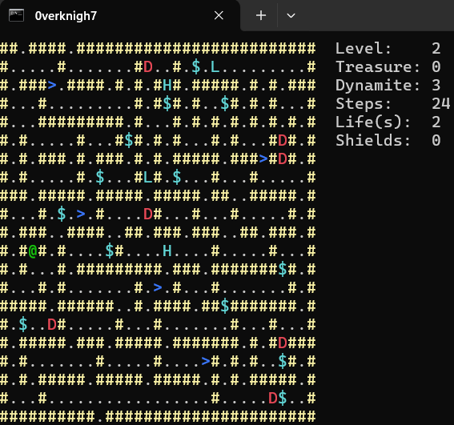

# 0verknigh7  [](https://github.com/su8/0verknigh7/actions/workflows/c-cpp.yml)
Small Rogue c++ game that I found on reddit - https://www.reddit.com/r/roguelikedev/comments/kxannr/quest_for_the_orb_a_minimal_roguelike_in_317/ , hats off to https://www.reddit.com/user/aotdev/ who shared the game and I forked it here



### Features:

Turn-based

Permadeath

Infinite procedurally generated dungeon

Victory condition: retrieve the orb! Legend says it lies somewhere between levels 16-25

What can you do in the game?

Explore! Walking to a wall or pressing random keys skips a turn

Collect treasure: just walk over it

Avoid the rotating disc-blades: They move always towards a random direction except the one they came from, and they bounce off dead-ends

Destroy neighbouring walls and disc-blades with dynamite. But be careful, you have only 3!

Find the stairs to the next level, hoping to find the orb there

You can walk off the edge of the map and come out the other side, if there is a floor there

Input configuration: map your own keys. Don't use arrow keys on repl.it though, as they misbehave.

Increasing difficulty: there are more disc-blades deeper into the dungeon

Welcome screen in glorious ASCII HD

Victory screen in glorious ASCII HD with derived score from turn count, treasure and dynamites left

UI showing step count, treasure collected, level and dynamites left

---

# Compile

```make
make -j8 # to use 8 cores/threads in parallel compile
sudo make install
```
Now to run the game type `0verknigh7`.

---

## Windows users

Tested with [Visual Studio Code Editor](https://code.visualstudio.com/download), but you need to install [MingW](https://github.com/niXman/mingw-builds-binaries/releases/download/12.2.0-rt_v10-rev0/x86_64-12.2.0-release-posix-seh-rt_v10-rev0.7z), once downloaded extract it to **C:\MingW**, then re-open [Visual Studio Code Editor](https://code.visualstudio.com/download), you might want to install C\C++ extensions if you plan to write C\C++ code with the editor. If you plan to contribute to this project go to **File->Preferences->Settings** and type to search for **cppStandard** and set it to c17 to both C++ and C.

I use **One Monokai** theme for the [VScode Editor](https://code.visualstudio.com/download)

In [Visual Studio Code Editor](https://code.visualstudio.com/download), go to **Terminal->Configure Tasks...->Create tasks.json from template** and copy and paste this into it:

```json
{
  "version": "2.0.0",
  "tasks": [
    {
        "type": "cppbuild",
        "label": "C/C++",
        "command": "C:\\MingW\\bin\\g++.exe",
        "args": [
            "-fdiagnostics-color=always",
            "-std=c++17",
            "-ggdb",
            "-lpthread",
            "-Wall",
            "-Wextra",
            "-O2",
            "-pipe",
            "-pedantic",
            "-Wundef",
            "-Wshadow",
            "-W",
            "-Wwrite-strings",
            "-Wcast-align",
            "-Wstrict-overflow=5",
            "-Wconversion",
            "-Wpointer-arith",
            "-Wformat=2",
            "-Wsign-compare",
            "-Wendif-labels",
            "-Wredundant-decls",
            "-Winit-self",
            "${file}",
            "-o",
            "${fileDirname}/${fileBasenameNoExtension}"
        ],
        "options": {
            "cwd": "C:\\MingW\\bin"
        },
        "problemMatcher": [
            "$gcc"
        ],
        "group": {
            "kind": "build",
            "isDefault": true
        },
        "detail": "compiler: C:\\MingW\\bin\\g++.exe"
    }
]
}
```

### To compile the game press **CTRL** + **SHIFT** + **B** , then from the same folder start the `0verknigh7.bat` script.

Optioanlly if you want to play the game from VSCode's console -- wait until it compiles, after that press **CTRL** + **\`** and paste this `cp -r C:\Users\YOUR_USERNAME_GOES_HERE\Desktop\main.exe C:\MingW\bin;cd C:\MingW\bin;.\main.exe`

---

## Uninstall

```make
sudo make uninstall
```
